# JavaScript-Exercises
Online Exercise Code Academy - JavaScript

Name: Abhisekh Ravlekar

JavaScript: Code Academy ( Online Class: Exercises )

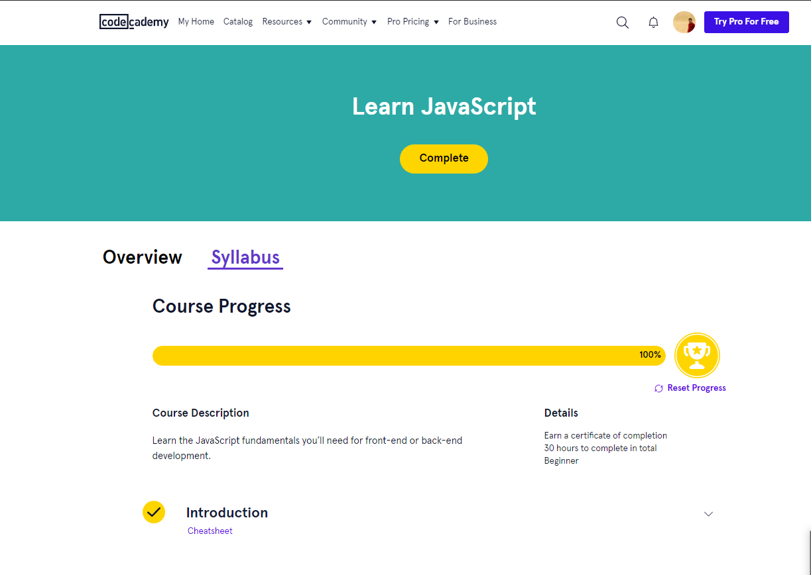

1. Introduction to JavaScript

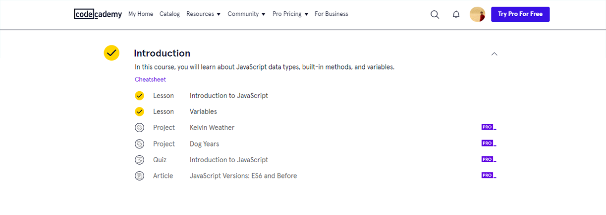

2. Conditional Statements

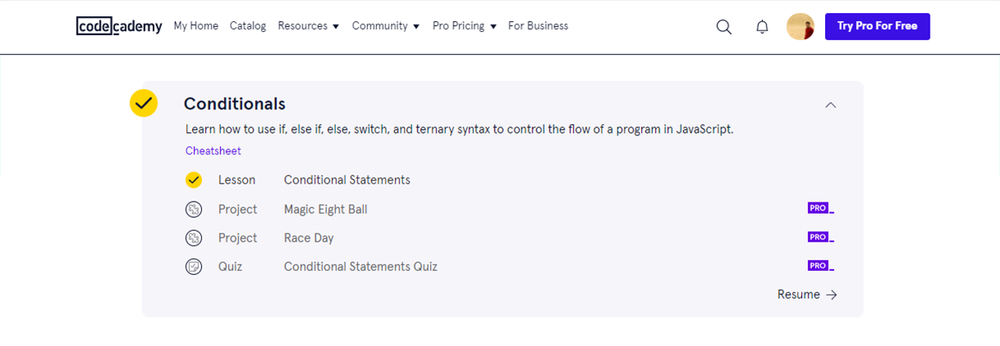

3. Functions

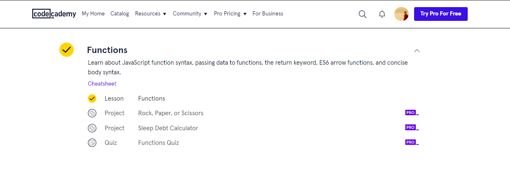

4. Scope

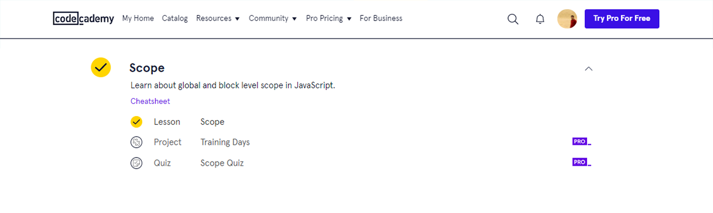

5. Arrays

6. Loops

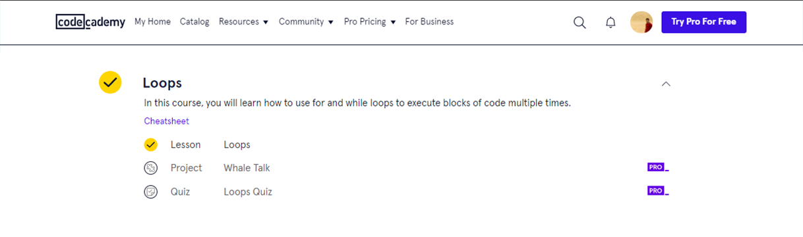

7. Iterators

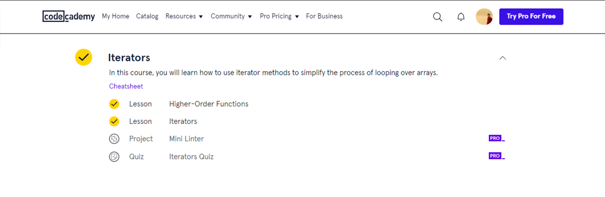

8. Objects

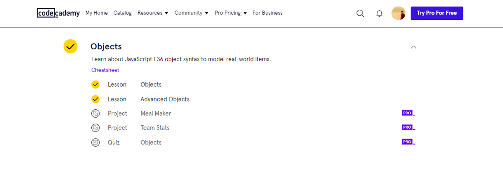

9. Classes

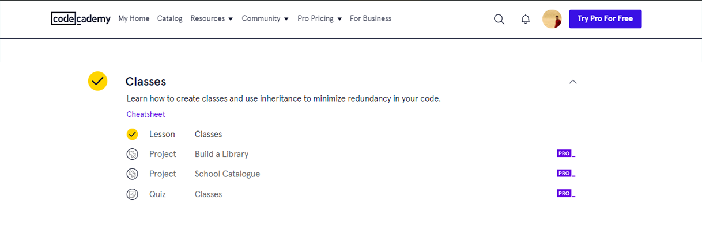

10. Browser Compatibility and Transpilation

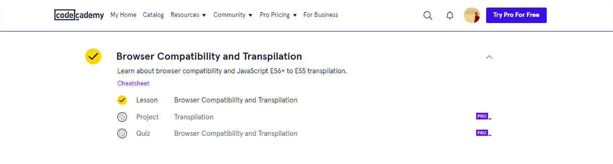

11. Modules

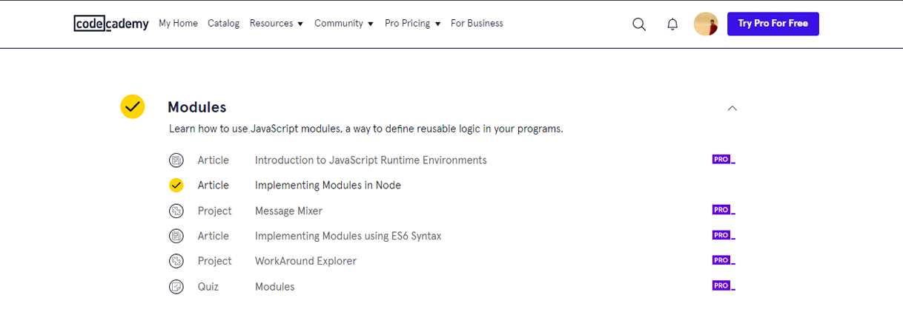

12. Promises

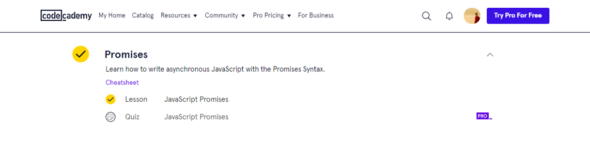

13. Async Await

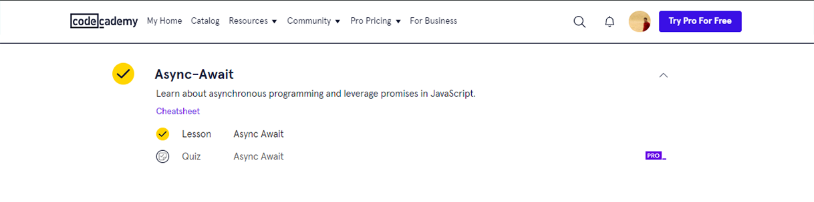

14. Requests

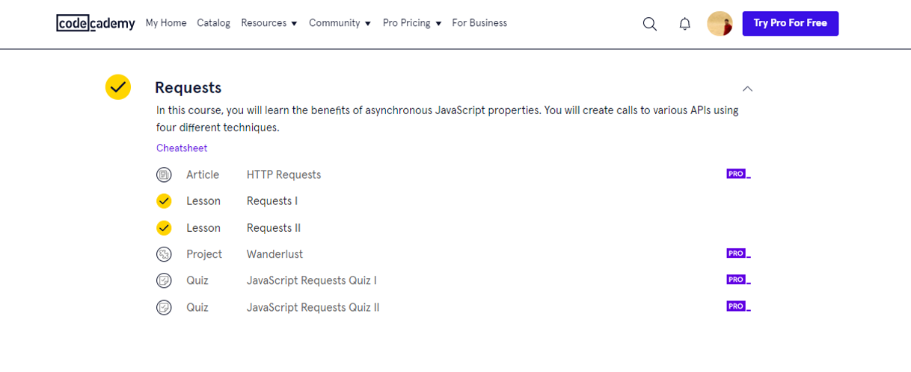

