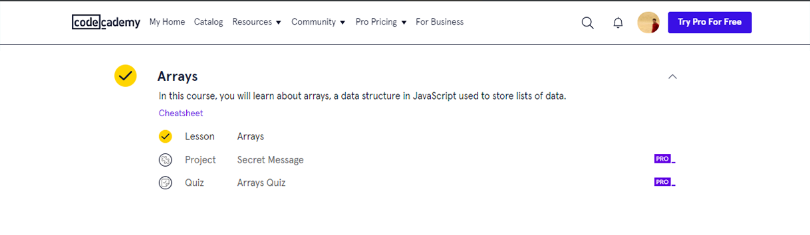

# JavaScript-Exercises
Online Exercise Code Academy - JavaScript

Name: Abhisekh Ravlekar

JavaScript: Code Academy ( Online Class: Exercises )

1. Online Class Exercises

2. Introduction to JavaScript

3. Introduction to Functions in PHP

4. PHP Built in Functions

5. Learn PHP Arrays

6. HTML Form Handling in PHP

7. Conditionals and Logic in PHP

8. Loops in PHP

9. PHP Form Validation

10. Classes and Objects in PHP

7. Conditionals and Logic in PHP

8. Loops in PHP

9. PHP Form Validation

10. Classes and Objects in PHP

